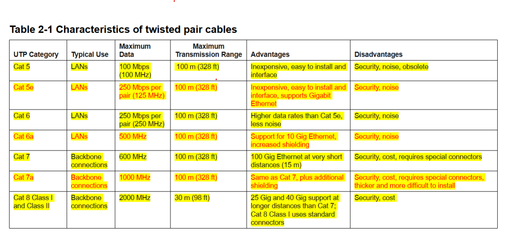

NOC - Network operating center
Air gapped - Isolated from the rest of the available networks
WAP vs AP - Same thing. Sometimes the W (wireless) is omited


All people seem to need data processing
application - presentation - session - transport - network - data link - physical 

Please do not throw sausage pizza away
*inverted

bandwidth: 
throughput: speed

NIC (network interface card)

Netstat?

## Ports breakdown
0 to 1023 - well known  
1024 to 49151 - registered  
49152 to 65535 - ephemeral  

find the ports and designations***

sudo nmap -A -6 --reason -sV scanme.nmap.org

## Bandwidth vs Throughput

**Bandwidth** is the maximum rate at which data can be transferred over a network connection, usually measured in bits per second (bps). It represents the capacity of the link.

**Throughput** is the actual rate at which data is successfully transferred over the network, also measured in bps. Throughput is often lower than bandwidth due to network congestion, latency, and protocol overhead.

**Summary:**
- Bandwidth = theoretical maximum capacity
- Throughput = actual achieved data transfer

## Datagram vs Segment

- **Datagram**: Used in connectionless protocols like UDP (User Datagram Protocol). A datagram is a self-contained message sent independently of other messages.
- **Segment**: Used in connection-oriented protocols like TCP (Transmission Control Protocol). A segment is a piece of a larger data stream, sent with sequencing and reliability features.

**Summary:**
- UDP → Datagram
- TCP

## STUN

**STUN** (Session Traversal Utilities for NAT) is a protocol used to discover the public IP address and port assigned by a NAT (Network Address Translator). It helps devices behind NATs establish peer-to-peer UDP connections, commonly used in VoIP and video conferencing.

- **Default port:** UDP 3478

Example usage (with `stun` command-line tool):

```bash
stun
```

## Attenuation in Networking

**Attenuation** refers to the gradual loss of signal strength as it travels through a transmission medium, such as a cable or wireless channel. In networking, attenuation can cause data errors and reduce the effective range of communication.

- Common causes: distance, interference, poor quality cables.
- Solutions: repeaters, amplifiers, using higher quality cables, or fiber optics.

**Summary:**  
Attenuation is the weakening of a signal over distance, impacting network performance.




## Multimode Fiber

**Multimode fiber** is a type of optical fiber designed to carry multiple light modes simultaneously. It is commonly used for short-distance data transmission in LANs and data centers.

- **Core diameter:** Typically 50 or 62.5 micrometers.
- **Maximum distance:** 300–550 meters (varies by type and transmission speed).
- **Common speeds:** 1 Gbps, 10 Gbps, 40 Gbps, 100 Gbps.
- **Advantages:** Lower cost, easier to connect and install.
- **Limitations:** More susceptible to attenuation and modal dispersion over long distances compared to singlemode fiber.

**Summary:**  
Multimode fiber is ideal for high-speed, short-range networking within buildings or campuses.


## Penetration testing
shodan.io

## Patch Tuesday

**Patch Tuesday** is the unofficial term for the day when Microsoft releases scheduled software updates and security patches for its products. It occurs on the **second Tuesday of each month**. These updates address vulnerabilities, fix bugs, and improve performance for Windows and other Microsoft software.

**Summary:**  
Patch Tuesday = Microsoft's monthly update release day (second Tuesday).

## Computer Virus Digital Signature

A **computer virus digital signature** is a unique pattern or sequence of bytes used by antivirus software to identify and detect specific viruses or malware. These signatures are created by analyzing the code of known viruses and are stored in antivirus databases.

- Antivirus programs scan files and memory for these signatures.
- When a match is found, the software flags the file as infected.
- Digital signatures help automate and speed up virus detection.

**Summary:**  
A virus digital signature is a fingerprint used by antivirus tools to recognize and block malware.

## OSINT (Open Source Intelligence)

**OSINT** stands for Open Source Intelligence. It refers to the process of collecting and analyzing publicly available information from sources such as websites, social media, news articles, public records, and forums to gather intelligence.

- Used in cybersecurity, penetration testing, law enforcement, and research.
- Common OSINT tools: Shodan, Maltego, theHarvester, Google Dorks.
- Helps identify vulnerabilities, gather information about targets, and assess risks.

**Summary:**  
OSINT is intelligence gathered from publicly accessible sources for investigative or security purposes.

## SET (Social Engineering Toolkit)

**SET** stands for Social Engineering Toolkit. It is an open-source penetration testing framework designed for social engineering attacks.

- Developed by TrustedSec.
- Used to simulate attacks like phishing, credential harvesting, and more.
- Helps organizations test and improve their security awareness and defenses against social engineering threats.

**Summary:**  
SET is a toolkit for creating and testing social engineering scenarios in cybersecurity.

## SHA

**SHA** stands for Secure Hash Algorithm. It is a family of cryptographic hash functions designed to provide data integrity and authentication. SHA algorithms generate a fixed-size hash value from input data.

- Common versions: SHA-1 (160-bit), SHA-256 (256-bit), SHA-512 (512-bit).
- Used in digital signatures, certificates, and data integrity checks.
- SHA-2 (including SHA-256 and SHA-512) is recommended for security; SHA-1 is considered weak.

**Summary:**  
SHA algorithms create secure hash values for verifying data integrity and authenticity.

## MD5

**MD5** (Message Digest 5) is a widely used cryptographic hash function that produces a 128-bit (16-byte) hash value, typically represented as a 32-character hexadecimal number. It is commonly used to verify data integrity by generating a unique fingerprint for files or messages.

- Not recommended for security-sensitive applications due to vulnerabilities (collision attacks).
- Still used for checksums and basic integrity verification.

**Summary:**  
MD5 creates a unique hash for data, but is not secure for cryptographic purposes.

## Metasploitable 2

**Metasploitable 2** is a vulnerable virtual machine (VM) designed for testing and practicing penetration testing tools and techniques. It is intentionally configured with outdated software and security flaws to provide a safe environment for learning about vulnerabilities and exploitation.

- Commonly used with Metasploit Framework, Nmap, and other security tools.
- Includes vulnerable services such as FTP, SSH, web servers, and databases.
- Used in cybersecurity labs, Capture The Flag (CTF) competitions, and training.

**Summary:**  
Metasploitable 2 is a purposely insecure VM for practicing ethical hacking and vulnerability assessment.

## Metasploitable 3

**Metasploitable 3** is a vulnerable virtual machine (VM) designed for penetration testing and security training, similar to Metasploitable 2 but with more modern vulnerabilities and services.

- Built using automated scripts (Vagrant, Packer) for easier customization.
- Includes Windows and Linux versions.
- Contains vulnerabilities in web applications, databases, and operating system components.
- Used for practicing exploitation, privilege escalation, and post-exploitation techniques.

**Summary:**  
Metasploitable 3 is an intentionally vulnerable VM for advanced penetration testing and cybersecurity learning.


## ROE (Rules of Engagement)

**Rules of Engagement (ROE)** are guidelines and boundaries established before conducting penetration testing, ethical hacking, or security assessments. ROE define what is allowed, what is off-limits, the scope of testing, communication protocols, and reporting requirements.

- Specifies which systems, networks, and data can be tested.
- Outlines acceptable testing methods and tools.
- Defines timeframes, escalation procedures, and contacts.
- Ensures legal and ethical compliance.

**Summary:**  
ROE are the agreed-upon rules that govern how a security test or assessment is conducted.


## Protocol Analyzer

A **protocol analyzer** is a tool or software used to capture, inspect, and analyze network traffic. It helps network administrators and security professionals troubleshoot issues, monitor performance, and detect malicious activity by decoding the protocols used in network communications.

- Examples: Wireshark, tcpdump, Microsoft Network Monitor.
- Can display packet details for protocols like TCP, UDP, HTTP, DNS, etc.
- Useful for diagnosing network problems, analyzing security incidents, and learning how protocols work.

**Summary:**  
A protocol analyzer captures and examines network packets to help understand and troubleshoot network communications.


## Port Scanner

A **port scanner** is a tool or software used to discover open ports and services on a networked device. It helps network administrators and security professionals identify which ports are accessible and what services are running, which can be useful for troubleshooting and security assessments.

- Examples: Nmap, Netcat, Angry IP Scanner.
- Can scan a single host or a range of IP addresses.
- Used to detect vulnerabilities, unauthorized services, or misconfigurations.

**Summary:**  
A port scanner probes network devices to find open ports and running services.


## Vulnerability Scanner

A **vulnerability scanner** is a tool or software that automatically scans computers, networks, or applications for known security weaknesses and vulnerabilities.

- Identifies missing patches, misconfigurations, outdated software, and exploitable flaws.
- Generates reports with risk ratings and remediation recommendations.
- Examples: Nessus, OpenVAS, Qualys, Rapid7 Nexpose.

**Summary:**  
A vulnerability scanner helps detect and assess security risks in systems before attackers can exploit them.


## RFP (Request for Proposal)

An **RFP (Request for Proposal)** is a formal document issued by organizations to solicit bids from vendors or service providers for a specific project or solution. It outlines the requirements, scope, evaluation criteria, and submission guidelines for the project.

- Used to compare solutions, pricing, and capabilities from multiple vendors.
- Common in IT, cybersecurity, and business procurement.
- Helps organizations select the best provider for their needs.

**Summary:**  
An RFP is a document used to request detailed proposals from vendors for products or services.


## IP (Internet Protocol)

**IP** stands for Internet Protocol. It is a set of rules that governs how data is sent and received over networks. IP is responsible for addressing, routing, and delivering packets of data from one device to another across networks, including the internet.

- **IPv4:** Uses 32-bit addresses (e.g., 192.168.1.1).
- **IPv6:** Uses 128-bit addresses (e.g., 2001:0db8:85a3::8a2e:0370:7334).
- Works at the network layer of the OSI model.
- IP addresses uniquely identify devices on a network.

**Summary:**  
IP enables devices to communicate and exchange data across networks using unique addresses.

## IP (Intellectual Property)

**Intellectual Property (IP)** refers to creations of the mind, such as inventions, literary and artistic works, designs, symbols, names, and images used in commerce. IP is protected by law through patents, copyrights, trademarks, and trade secrets.

- **Patents:** Protect inventions and processes.
- **Copyrights:** Protect original works of authorship (books, music, software).
- **Trademarks:** Protect brand names, logos, and slogans.
- **Trade Secrets:** Protect confidential business information.

**Summary:**  
Intellectual Property is legal protection for creative and innovative works, giving creators exclusive rights to use and benefit from their creations.


## Whaling in Cybersecurity

**Whaling** is a type of phishing attack that targets high-profile individuals within an organization, such as executives, CEOs, or other senior leaders. The goal is to trick these "big fish" into revealing sensitive information, transferring funds, or performing actions that benefit the attacker.

- Attacks are highly personalized and convincing.
- Often use spoofed emails, fake invoices, or urgent requests.
- Can lead to significant financial loss or data breaches.

**Summary:**  
Whaling is a targeted phishing attack aimed at executives or high-value targets in an organization.


## EASM (External Attack Surface Management)

**External Attack Surface Management (EASM)** is a cybersecurity practice focused on identifying, monitoring, and managing an organization’s exposed digital assets and vulnerabilities that are accessible from the internet.

- Includes domains, IP addresses, cloud services, web applications, and third-party integrations.
- Helps organizations discover unknown or forgotten assets (shadow IT).
- Enables proactive risk management by continuously scanning for exposures and vulnerabilities.

**Summary:**  
EASM helps organizations understand and secure all internet-facing assets to reduce the risk of external attacks.

## **Term:** OpenVOS

**Definition:**  
OpenVOS is a high-availability operating system created by Stratus Technologies, engineered for fault-tolerant servers that support mission-critical applications requiring continuous processing and data integrity. It evolved from the original VOS (Virtual Operating System) and incorporates POSIX compliance and support for open-source tools.

**Key Components:**
- Runs on Stratus ftServer® platforms with lockstepped hardware for fault tolerance.
- Supports multiple programming languages including PL/I, C, COBOL, and Pascal.
- Offers POSIX-compliant features and compatibility with open-source packages.
- Provides robust networking capabilities and system resource management.

**Purpose & Benefits:**
- Ensures **99.999% uptime** for applications in industries like finance, manufacturing, and transportation.
- Enables secure and reliable **online transaction processing (OLTP)**.
- Facilitates **open-system development** with flexible tools and protocols.
- Minimizes downtime in **lights-out IT environments** and remote operations.

**Summary:**  
OpenVOS delivers a fault-tolerant, secure, and high-performance operating environment for organizations that demand uninterrupted service and data integrity in their most critical systems.

## **Term:** OpenVAS (Open Vulnerability Assessment System)

**Definition:**  
OpenVAS is a full-featured, open-source vulnerability scanning tool designed to detect and assess security flaws in IT infrastructure. It performs unauthenticated and authenticated scans across various protocols and platforms, helping organizations identify misconfigurations, outdated software, and exploitable vulnerabilities.

**Key Components:**
- **OpenVAS Scanner**: Executes vulnerability tests using Network Vulnerability Tests (NVTs).
- **OpenVAS Manager**: Handles scan configurations, schedules, and results.
- **Greenbone Security Assistant (GSA)**: Web-based GUI for managing scans and viewing reports.
- **OpenVAS CLI**: Command-line interface for advanced scan control.
- **Greenbone Security Feed (GSF)**: Provides daily updates of NVTs to detect the latest threats.
- **OpenVAS Libraries**: Support core functionalities like data storage and cryptographic operations.

**Purpose & Benefits:**
- Enables comprehensive vulnerability assessments for internal and external assets.
- Supports continuous security monitoring and compliance efforts.
- Assists penetration testers and security analysts in identifying exploitable weaknesses.
- Integrates with broader security frameworks for automated risk management.

**Summary:**  
OpenVAS helps organizations proactively detect and manage vulnerabilities by providing a robust, open-source scanning platform that supports detailed analysis and remediation planning.


## **Term:** Open Source Intelligence (OSINT)

**Definition:**  
Open Source Intelligence (OSINT) refers to the process of collecting, analyzing, and leveraging publicly available information to produce actionable intelligence. It involves gathering data from sources that are legally and openly accessible to anyone.

**Key Components:**
- Public websites, social media platforms, blogs, forums, and news outlets.
- Government publications, academic papers, and corporate disclosures.
- Metadata, geolocation data, and multimedia content (images, videos).

**Purpose & Benefits:**
- Supports threat intelligence, investigations, and situational awareness.
- Enhances cybersecurity by identifying potential risks and adversary behavior.
- Aids law enforcement, military, and private sector in decision-making and risk mitigation.

**Summary:**  
OSINT empowers organizations and analysts to extract valuable insights from publicly available data, helping to detect threats, understand adversaries, and inform strategic actions.
## **Term:** OSINT Framework

**Definition:**  
OSINT Framework is an organized directory of categorized tools and resources that assist analysts, investigators, and cybersecurity professionals in collecting and analyzing open source intelligence (OSINT). It provides links to websites and services that support data gathering from public sources.

**Key Components:**
- Categorized by data type: usernames, email addresses, IPs, domains, social media, geolocation, and more.
- Includes both free and paid tools for reconnaissance and investigation.
- Designed for ease of navigation with a tree-style interface.
- Frequently used in penetration testing, threat hunting, and digital forensics.

**Purpose & Benefits:**
- Streamlines the OSINT process by centralizing access to relevant tools.
- Enhances efficiency in gathering intelligence for cybersecurity, law enforcement, and investigative journalism.
- Supports ethical and legal data collection from public sources.
- Helps identify digital footprints, vulnerabilities, and threat actors.

**Summary:**  
OSINT Framework is a valuable resource hub that simplifies the process of collecting and analyzing publicly available data, empowering professionals to conduct effective and ethical open source investigations.


## **Term:** CVE in NVD (National Vulnerability Database)

**Definition:**  
CVE in NVD refers to the integration of Common Vulnerabilities and Exposures (CVE) entries into the National Vulnerability Database (NVD), where each CVE is expanded with detailed technical and contextual information to support vulnerability management and risk assessment.

**Key Components:**
- **CVE ID**: Unique identifier for each vulnerability (e.g., CVE-2025-12345).
- **CVSS Score**: Severity rating based on the Common Vulnerability Scoring System.
- **Impact Metrics**: Confidentiality, integrity, and availability ratings.
- **Affected Products**: Specific software versions and vendors impacted.
- **Remediation Guidance**: Fixes, patches, and mitigation strategies.
- **Advanced Search Filters**: By OS, vendor, product, version, and vulnerability type.

**Purpose & Benefits:**
- Enhances CVE records with actionable intelligence for defenders and developers.
- Supports prioritization of vulnerabilities based on severity and exploitability.
- Facilitates integration with security tools like SIEMs, scanners, and dashboards.
- Promotes standardized vulnerability tracking across organizations and industries.

**Summary:**  
CVE entries in the NVD provide enriched vulnerability data that helps organizations assess risk, prioritize remediation, and strengthen their cybersecurity posture using standardized and detailed information.

## **Term:** 802.11 (Wi-Fi Standard)

**Definition:**  
802.11 is a set of IEEE standards that define wireless local area networking (WLAN) protocols, commonly known as Wi-Fi. These standards specify how devices communicate over radio frequencies to enable wireless connectivity in homes, businesses, and public spaces.

**Key Components:**
- **Frequency Bands**: Operates primarily in 2.4 GHz and 5 GHz bands (with newer standards using 6 GHz).
- **Variants**: Includes multiple versions such as 802.11a/b/g/n/ac/ax (Wi-Fi 6) and 802.11be (Wi-Fi 7).
- **Modulation Techniques**: Uses OFDM, DSSS, and other methods to transmit data efficiently.
- **Security Protocols**: Supports WPA, WPA2, WPA3 for secure communication.
- **MAC Layer**: Manages access control, authentication, and data framing.

**Purpose & Benefits:**
- Enables wireless internet access and device connectivity without physical cables.
- Supports high-speed data transmission for streaming, gaming, and enterprise applications.
- Facilitates mobility and scalability in network design.
- Powers smart homes, IoT devices, and mobile computing.

**Summary:**  
802.11 defines the technical foundation for Wi-Fi, allowing devices to connect wirelessly to networks and the internet using standardized protocols across various frequency bands and performance tiers.

## **Term:** IEEE 802.3

**Definition:**  
IEEE 802.3 is a set of standards developed by the Institute of Electrical and Electronics Engineers (IEEE) that defines the physical and data link layers for wired Ethernet networks. It specifies how devices communicate over various types of physical media using Carrier Sense Multiple Access with Collision Detection (CSMA/CD).

**Key Components:**
- **CSMA/CD Protocol**: Governs how devices detect and handle data collisions on shared media.
- **Physical Media Support**: Includes twisted pair, coaxial cable, and fiber-optic connections.
- **Ethernet Variants**: Covers standards like 10BASE-T, 100BASE-TX, 1000BASE-T (Gigabit Ethernet), and 10GBASE-T.
- **Frame Format**: Defines structure for Ethernet frames including headers, payload, and checksum.
- **Speed Range**: Supports data rates from 10 Mbps to 400 Gbps depending on the variant.

**Purpose & Benefits:**
- Provides a universal framework for wired LAN communication.
- Ensures interoperability across devices and vendors.
- Enables scalable, high-speed, and reliable network infrastructure.
- Supports backward compatibility and future expansion.

**Summary:**  
IEEE 802.3 defines the foundational standards for Ethernet networking, enabling consistent and efficient wired communication across diverse environments and technologies.

**Sources:**  
- [IEEE Standards Association – IEEE 802.3 Overview](https://standards.ieee.org/ieee/802.3/6210/)
- [Ethernet Alliance – Ethernet Technology](https://ethernetalliance.org/)

